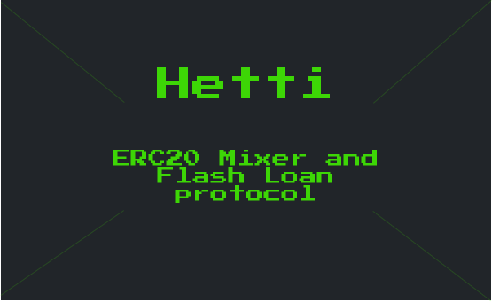

# Hetti
### An ERC20 mixer and flash loan protocol

One of the biggest issues on a public blockchain like polygon is the lack of privacy. Because all transactions on the blockchain are public, it is possible for anyone to see the details of any transaction, including the sender, receiver, and amount involved. This lack of privacy can be a problem for users who want to keep their financial transactions private.

There are also privacy concerns related to the use of Polygon-based tokens (ERC20, ERC721 e.t.c). Many tokens are built on top of the Polygon platform, and these tokens can be used to represent a wide range of assets, including financial instruments, physical assets, and even voting rights. However, because these tokens are built on the blockchain, their transactions are publicly visible, which can raise privacy concerns for users who want to keep their token transactions private. Overall, this can be a significant issue for users who value their privacy (i.e [me](https://twitter.com/keosariel)). 

#### **Hetti** is a decentralized finance (DeFi) platform built on the Polygon blockchain (testnet) that allows users to make anonymous transactions.
------

### Privacy

There are several advantages to using **Hetti** for anonymous transactions. First, because Hetti is built on the Polygon blockchain, it offers users the security and immutability of the Polygon network. This means that users can trust that their transactions will be secure and that they cannot be tampered with or reversed.

Second, **Hetti** uses **[Stealth addresses](https://www.getmonero.org/resources/moneropedia/stealthaddress.html)** (ECDH) to generate a shared secret between the sender and recipient. Think of this as a burner wallet (a wallet used just one-time) where only the sender and recipient knows the secret-key.

Third, with the help of **[Linkable ring signatures](https://www.getmonero.org/resources/moneropedia/ringsignatures.html#:~:text=Application%20to%20Monero,to%20form%20possible%20signer%20participants.)**, **Hetti** is able to verify a single signature originated from a ring of signatures, and also keeps track of previous signed messages so nobody double-spends.

Lastly, one can choose to implement a relayer for a **Hetti** and they would be take a persentage of the money being withdrawn. Also with the fees from the flashloans in any pool users would pay far less fees than usual.

With the combination of both stealth addresses and ring signatures, we are able to anonymise the link between the senders and recipients entirely on-chain, in a trustless manner, with no trusted setup.

### Flash loans
-------

Any one can create a Mixer for any **ERC20** token, and at this point can serve as a liquidity pool. Since, money would be sitting around for some time in the mixer contract, We have implemented additional functionality to allow anyone take a flash loan from a pool. This is only done because there isn't any financial risk in flash loans, and reduces the fees paid to relayers.

